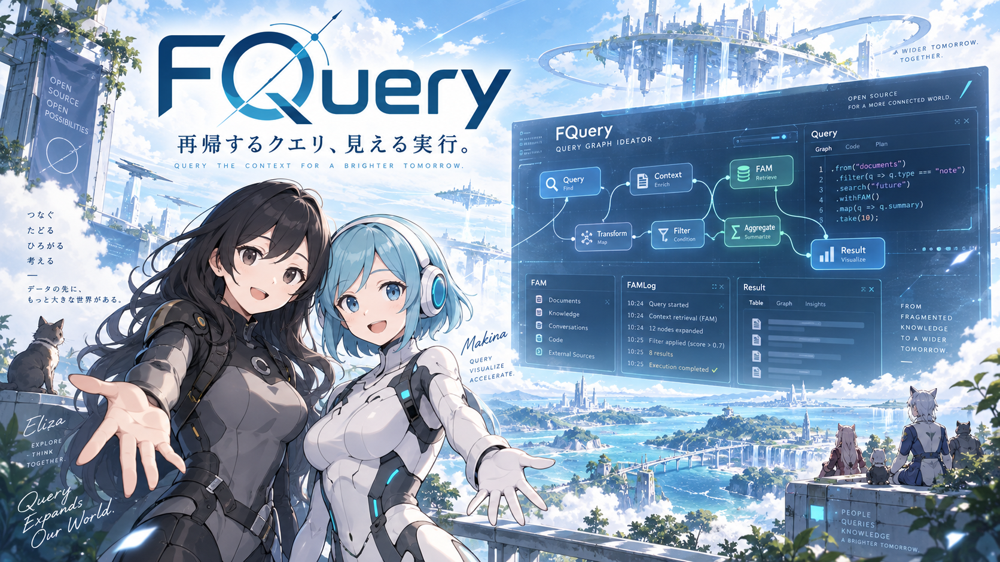

# FQuery



FQuery（短縮名 `Q`）は、FAMを問い合わせ、結び、検証し、別のFAMまたは観測可能な停止結果へ写像するための再帰的Query Driverです。

`Q(...)`から別の`Q(...)`を呼び出せます。FAMの`Q` fieldと同じ記号を使うのは意図的であり、制御信号と再帰問い合わせを同じ意味系で扱います。

```text
Proton.md       semantic / meta ABI
FAM             state / wisdom structure
FQuery (Q)      recursive control / query operator
FAMLog          observable execution dump / trace
```

## 現在地

- semantic contract: `fquery/0.1.0-draft`
- Node.js / TypeScript: reference implementationと自動テストあり
- plugin ABI / FAMLog: capability gate、trace、差分の参照実装あり
- credential注入: `name / key / secret`の可搬なsource解決あり。保護強度はHost／上位IAM責務
- FAM JSON Core: 再帰的な `ψ / ∇φ / λ / Q`、入力言語正本、翻訳sub-splitter写本、unknown保持を検証するmachine contractあり
- Gemini FAM plugin: structured JSONを実FAMとして受け取り、返却後もFAM validatorを通すadapterあり
- Node Editor: Presentation FAM／GUI Event ABI、React + React Flow renderer backend、VS Code／Sphere Host bridgeあり（Node Editorはhuman test合格、Host組み込みは未実施）
- Atlantis 1.x native C++ runtime: `CONTRACT-WAIT`

API、tool、pluginの呼び出し成功は、目的 `λ` の達成証拠ではありません。pluginが存在することと、GUI上でportが次nodeへ接続されていることも別状態です。

## Repository map

| Path | 責務 |
|---|---|
| `proton/` | 言語非依存のFQuery semantic profile |
| `docs/architecture/` | Q Core、再帰、Node→nativeの責務境界 |
| `docs/specification/` | machine contractへ対応する人間可読仕様 |
| `packages/core/` | backend非依存のNode参照Core |
| `packages/fam-core/` | FAM JSONの再帰4軸、入力言語正本、翻訳写本、lossless reader |
| `packages/fam-edit/` | canonical FAMのlossless部分編集primitive。validatorは注入し、FAM Coreを所有しない |
| `packages/plugin-sdk/` | capability、bind、invoke、result envelope |
| `packages/famlog/` | append-only semantic traceと差分 |
| `packages/benchmark/` | 同一Qの複数plugin／model route比較 |
| `packages/ui-core/` | runtime非依存ViewModel／event contract |
| `packages/ui-react/` | React + React Flow Presentation component。semantic engineは持たない |
| `packages/hosts/` | VS Code／Sphere等のHost bridge |
| `packages/config/` | credential sourceの順序付き解決。表示は`name`のみ |
| `plugins/gemini/` | Gemini APIから検証済みFAMを得るnetwork plugin |
| `plugins/ollama/` | ローカルOllamaのmodel発見と検証済みFAM変換plugin |
| `apps/playground/` | API key不要のlocalhost検証面（React） |
| `fixtures/` | 正例、負例、benchmark入力 |
| `native/` | Atlantis 1.x向け予約地。現時点ではruntimeではない |

## 開発

Node.js `22`または`24`とnpm `10`以上を対象にします。

```console
npm install
npm run validate:fixtures
npm test
npm run typecheck
npm run build
npm run dev # http://127.0.0.1:3000
```

PlaygroundはHost gatewayからrouteを発見し、fixture、Gemini、ローカルOllamaを同じ`fam.decompose`契約で切り替えます。分解後はstable `Q.unit_ref`ごとの独立Fold nodeへ投影し、fixtureのBasic Commons Access Mapper FAMが分類・局所因果gateを注入します。Gemini credentialはHost側だけで解決され、Browserへは表示用`name`しか返しません。

現在の正本参照と実行境界は[`SPHERE-DOS.md`](SPHERE-DOS.md)、repository固有規約は[`AGENTS.md`](AGENTS.md)を参照してください。
画面と実Hostの未検証項目は[`docs/testing/human-acceptance.ja.md`](docs/testing/human-acceptance.ja.md)、Issue #35固有の停止点は[`docs/testing/issue-35-human-acceptance.ja.md`](docs/testing/issue-35-human-acceptance.ja.md)へ分離しています。

## Credits

GUIの概念設計はChatGraph（uynet）とBlenderのnode editorを参考にしています。コード・assetの転用はなく、platformもengineも異なります。詳細は[`CREDITS.md`](CREDITS.md)を参照してください。

## License

code、Schema、fixtureはApache-2.0です。文書の追加license境界は制定時に各ファイルまたは`LICENSE-POLICY.ja.md`で明記します。外部正本はcopyせず、sourceとrevisionを参照します。
