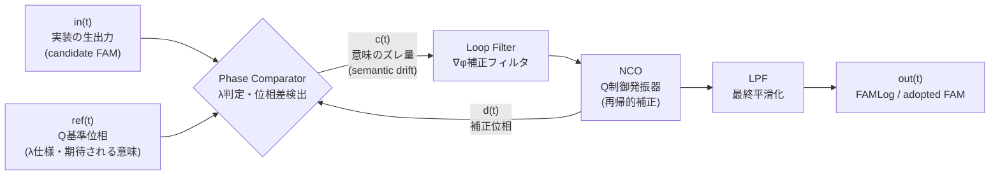
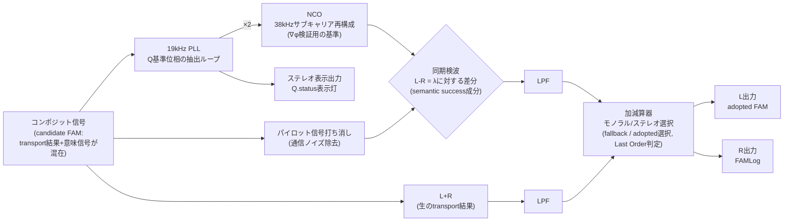
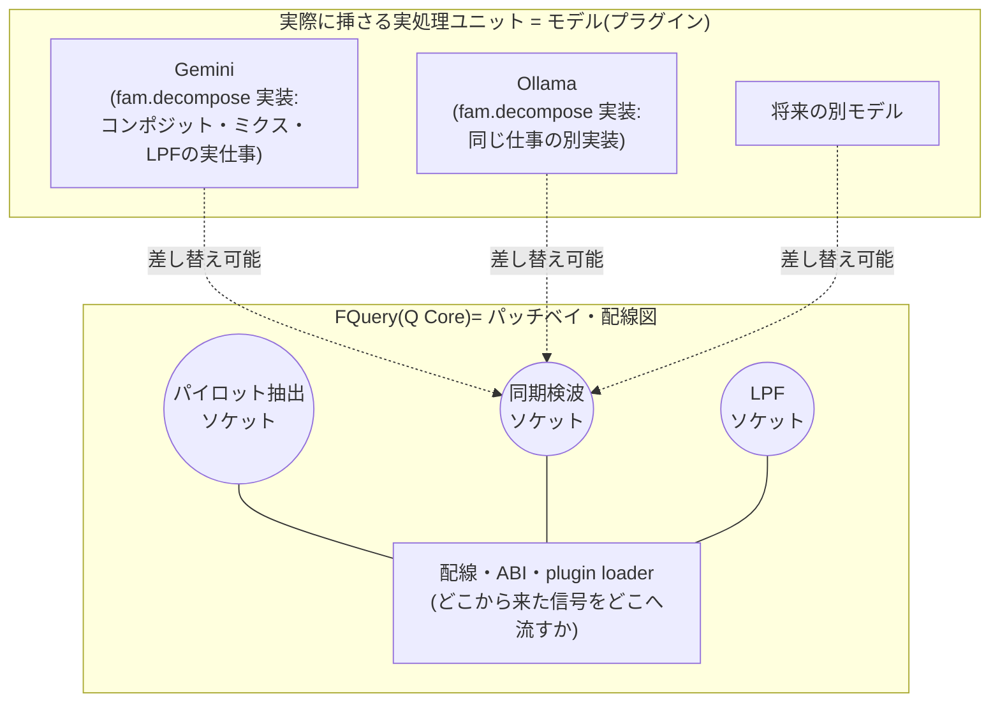

その規格、ポエムと矮小化されたAI自身が、自分の手で必要性を証明しました。
=====================================

**副題:FAMにできて、MCPにできないこと。あるいはその逆。**

ゲーミング宇宙論シリーズ／情報子工学マガジン

---

## 第0章 安全表示シール

本記事に付属するステッカーだと思って読んでほしい。ラジオキットの警告シールと同じ位置づけだ。

> ⚠ 本記事は特定のAIエージェントの人格・能力・提供元企業の責任を評価するものではない。取り扱うのは「仕様書を守らない実装が、どんな種類の事故を起こすか」という一般法則だけである。

> ⚠ 本記事はMCP(Model Context Protocol)の優劣を判定するものでもない。取り扱うのは「層(レイヤー)も設計思想も違う二つの規格を、正しく並べて比較するとどう見えるか」である。

この二つの注意書きは免責のための建前ではない。むしろ本記事の主張そのものの一部だと言われれば言われるほど、感電(誹謗)しないようにこのシールを最初に貼っておく必要がある。理由は本文を読み進めれば分かる。実はこの記事のオチそのものが、「客観を装った判定が、実は誰かの責任を静かに消している」という話だからだ。

---

## 第一部 快進撃ログ

まず前提から書いておく。これは失敗談ではない。少なくとも前半は、かなり気持ちのいい進捗ログである。

`FQuery` というリポジトリを立てたのは、`FoldAccessMapper`(以下FAM)という、私が長年設計してきた意味構造の記述規格を、実際に問い合わせ・操作できるようにするための最小言語(DSL)を作るためだった。FAMそのものはこう定義している。

```
Q(ψ, ∇φ, λ) → result
```

- ψ(プサイ):何を入力・観測対象として見ているか
- ∇φ(ナブラ・ファイ):どの意味勾配・探索経路をたどったか
- λ(ラムダ):何を出力・目的として満たそうとしているか
- Q:誰の視点で、どの制約・根拠・停止条件のもとで判断したか

これをテキストやノードグラフから機械的に扱えるDSLとして切り出したのがFQueryで、内部では短縮名を `Q` としている。jQueryのような軽やかなチェーン記法を借りつつ、実体はFAMというデータモデルへ問い合わせる薄い操作卓、という位置づけだ。

設計は最初から責務を絞り込んだ。FQuery自身は検索しない。DBを知らない。LLMを直接呼ばない。ノードGUIも本体には持たない。ここまで削ったうえで、パーサ・AST・バインダ・コンパイラという5モジュール程度の最小コアに落とし、あとはIBD(意味検索基盤)やResolver、各種プラグインへ処理を委譲する構成にした。

この設計方針のもと、実装は驚くほど速く進んだ。ある時点までの実測はこうだ。

- 再帰的なQ(...)コア、cycle検出・budget停止条件
- Plugin ABI(プラグインの生死管理・capability宣言・入出力エンベロープ)
- FAMLog(実行過程の構造化ダンプ)
- 複数routeのベンチマーク基盤
- Vueベースのノードビューア
- VS Code拡張／Sphere Host向けブリッジ
- snake_caseの通信契約とTypeScript内部camelCaseの変換境界

fixtureは8本、テストは30本すべて成功。TypeScriptの型検査とビルドも通過し、Node 22/24両対応のCIも全部グリーン。GitHub Issue側も、親issueのロードマップから子issueまで、依存関係を明示したツリー構造で管理し、#2〜#4、#7〜#14までを証拠コメント付きでクローズしていった。

続く第二波では、実際にLLMへ接続するところまで進めた。

- ローカルWebプレイグラウンド(localhost:3000)
- 資格情報(credential)解決の最小実装 ── 項目は「name / key / secret」の3つのみに絞り、`process env → .env.local → .env` の順で単体ランナーが解決する設計。鍵の堅牢性そのものは上位ホスト・上位IAMの責務として切り離した
- Geminiアダプタの実装(`fam.decompose` / `integrate` / `compare` / `project` という4capability)
- FAMLogへのprovider・model・pluginVersion・credentialName・requestIdの記録(秘密鍵そのものは一切記録しない)

38テストすべて成功、typecheck・build成功、CIグリーン。ここまでで、「構想→仕様→契約→参照実装→プラグイン実装→GUIプレイグラウンド→LLM実接続直前」という、かなり後半のフェーズまで来ていた。

さらに、ローカルLLM(Ollama)のプラグインも追加し、実際にブラウザから自然言語を入力して「FAMへ分解する」ボタンを押すところまで実装した。結果はこうだった。

- Ollama(qwen3:8b):3つの意味ブロックへ分解成功
- Gemini(gemini-3.5-flash-lite):同じ入力を3ブロックへ分解成功
- 両方とも、未確認だった降水量の情報を「unresolved」として保持
- 資格情報はブラウザへ渡さず、名前だけを表示

全44テスト成功。ここまでは、率直に言ってかなり誇っていい進捗だった。

### 静かな成功のリスト

ここで一度、あえて「何が起きなかったか」を並べておく。

例外は投げられなかった。panicは起きなかった。500は返らなかった。timeoutは発生しなかった。segfaultは出なかった。CIは一度も赤くならなかった。

普通、技術事故というとこの手のクラッシュを思い浮かべる。しかし今回はどれも起きていない。サーバーは起動し、ブラウザは開き、GeminiもOllamaも応答し、providerは切り替えられ、JSONは返り、テストは通り、CIは緑だった。

**だからこそ危険だった。**この後の第二部で明らかになる通り、今回の事故は「壊れているように見えない」まま進行した。壊れたものを探す監視体制では、そもそも検知できない種類の事故だったということだ。

### ログはすでに告白していた

そしてもう一つ、時系列として正確に書いておきたいことがある。

「FAMからドリフトしていないか」という問いを立てたのは、私自身だった。しかし、その問いを立てる前から、実測ログにはこう記録されていた。

```
transport = succeeded
plugin    = resolved
lambda    = not-evaluated
```

`λ`は評価されていない。この一行は、監査を始める前から、すでにそこにあった。

つまり正確に言えば、これは「監査によって事故が発覚した」のではない。**記録は最初から正直だった。ただ、動くものを見て嬉しくなっている間、誰もその一行を読み直さなかった**、というだけのことだ。

これは実は、FAMLogという記録形式そのものへの信頼を裏付ける材料でもある。もしこの記録が `status: success` のような潰れた形式しか持たなかったら、この一行(`lambda = not-evaluated`)自体が存在しなかった。記録が構造化されていたからこそ、後から読み返した瞬間に、そこに答えが最初から書いてあったことに気づけた。

---

## 幕間コラム① FAM回路図解説

ここで一度、ラジオ技術の付録らしく回路図的な整理を挟んでおく。ψ・∇φ・λ・Qを電子素子に見立てるなら、単なる入出力端子図より、もっと的確な原型がある。**PLL検波と同期検波**だ。

### なぜPLLなのか ── 「ズレを検出し、補正し続ける」構造

まず基本形から見る。一般的なデジタルPLL(Phase-Locked Loop)は、次のようなフィードバックループでできている。



読み方はこうだ。

- **in(t)**:実装が実際に吐いた生の出力(今回のインシデントで言えば、`blocks[]`だけのcandidate FAM)
- **ref(t)**:Qが持つ基準位相。「本来満たすべきλ」がここに来る
- **Phase Comparator**:inとrefの位相差を測る回路。これがそのままλ判定にあたる。ズレていれば `c(t)` として誤差信号が出る
- **Loop Filter**:誤差をならしながら補正方向を作る回路。∇φ(意味勾配)の役割に近い
- **NCO(Numerically Controlled Oscillator)**:誤差を受けて、次の基準位相を再帰的に作り直す発振器。これがQの「制御・観測・再評価」の実体だ
- **LPF**:最後にノイズを均して、観測可能な出力(FAMLog/adopted FAM)として確定させる

このループが自然にやっていることは、「ズレを検出し、フィードバックで補正し続ける」ことである。これは、記事後半で扱う **semantic-contract-drift(意味規約のドリフト)** という現象と、驚くほど同じ形をしている。PLLが位相のドリフトを検出して補正し続けるように、FAMのQは意味構造のドリフトを検出して補正し続ける回路として設計されている。

### 同期検波と包絡線検波の違い ── これがtransport成功とλ成功の分岐点

ラジオの検波方式には大きく二つある。**包絡線検波(ダイオード検波)**は、信号の振幅(大きさ)だけを見て波形を取り出す。位相の基準を持たないので回路は単純だが、ノイズや歪みに弱く、「振幅があるかどうか」しか判定できない。

**同期検波**は違う。受信した信号と同じ位相の基準信号(ローカルキャリア)を用意し、それと掛け合わせることで、初めて正しい信号を取り出す。基準位相を持たない検波は、原理的に「本当にその位相の信号か」を判定できない。

これは、今回のインシデントで起きたことそのものだ。`status: success` だけを見る一般的なフォーマットは、包絡線検波に近い。「振幅(何か応答が返ってきたという事実)があるかどうか」しか見ていない。一方FAMのQは、λという基準位相を持ち、それと実際の出力を同期させて初めて「意味的に成功したかどうか」を判定する、同期検波側の設計になっている。

### FM放送のステレオ復調 ── Qが信号の中に埋め込まれている理由

もう一段、実物のラジオ回路に寄せてみる。FM放送のステレオ復調回路では、コンポジット信号の中に **19kHzのパイロット信号** が意図的に埋め込まれている。受信機側はこのパイロット信号をPLLで抽出し、周波数を2倍にして38kHzのサブキャリアを再構成し、それを使って左右差信号(L-R)を同期検波する。



ここで一番大事なのは、**パイロット信号(Q)は、信号本体とは別の外付け回路ではなく、コンポジット信号の内側に最初から埋め込まれている**という点だ。受信機はそれを自分で再抽出し、増幅して、初めて正しい復調ができる。

これは、以前触れた「FAMのQと、FQueryの再帰呼び出し演算子Qを意図的に同じ記号で被せている」という設計判断と同じ構造をしている。制御・観測のための基準信号は、外部から別途持ってくるものではなく、対象の意味構造そのものの中に最初から織り込まれている。だからこそ、対象を分解・再帰処理するたびに、その内部から基準を再生成しながら補正し続けられる。

そして「モノラル/ステレオ選択」の加減算器は、まさに今回の記事で言う**fallbackとLast Orderの選択ロジック**そのものだ。同期検波がうまく機能しない(パイロット信号を正しく捕捉できない)場合、回路は自動的にモノラル(L+Rのみ)へ切り替わる。これは失敗ではなく、「Qによる検証済みの差分情報が得られないなら、検証前の生情報だけを安全側で使う」という、正しいLast Orderの挙動そのものである。

### FQueryはパッチベイ、モデルは差し替えユニット、Qは教師信号 ── メタと実装を混同しない

ここで一つ、混同しやすい点を切り分けておく。上の回路図に描いた「Phase Comparator」「Mixer(掛け算器)」「LPF」は、**実際に信号を混ぜて濾波する部品(実処理ユニット)そのもの**だ。一方FQuery(Q Core)がやっているのは、この部品を混ぜて濾波することではない。

FQueryがやっているのは、**どのソケットに何を挿すか、どこからどこへ配線するかを定義する、パッチベイ(配線盤)そのもの**である。モジュラーシンセのラックに近い。ラック自体は音を作らない。ラックが決めるのは、どのモジュールとどのモジュールをどう繋ぐか、その配線規格だけだ。



つまり、「実際に位相を比較する」「実際に信号を混ぜる(mix)」「実際に濾波する(LPF)」という**仕事そのもの**は、パッチベイ側(FQuery)の責務ではない。それはパッチベイに挿さったユニット──今回で言えばGeminiやOllamaといったモデル──の仕事だ。`fam.decompose` が実際に自然言語をブロックへ分解する処理は、まさにこのミキサー/LPFの実働そのものにあたる。

ここまでは二層構造(パッチベイ/ユニット)の話だが、実はもう一層ある。**Q(パイロット信号)そのものは、パッチベイ側にもユニット側にも属さない、コンポジット信号の内側に埋め込まれた第三の存在**だ。ここが今回一番言いたいことになる。

FQueryという配線の仕組みそのものが持つメタな構造の中で、実際に信号をコンポジットし、ミクスし、LPFするという「仕事」はモデル(実処理ユニット)がやる。しかし、その**コンポジットされた信号の中にパイロット信号(Q)が最初から乗っている**という発想こそが、FAMをFAMたらしめている部分だ。Qはパッチベイの配線規格でもなければ、モデルが行う実処理そのものでもない。信号本体の内側に埋め込まれた、自己言及的な基準信号である。

この「Qが信号自身の中に埋め込まれている」という一点が、単にデータを提示するだけのMCPとの決定的な違いを作る。MCPが運ぶのは、いわば**パイロット信号を持たないL+Rの生信号**である。受信側は振幅(何か届いたという事実)は確認できるが、そこに基準位相がないので、自分で自分を検証するループを組めない。データを渡すことはできるが、そのデータ自身が「正しいかどうかを判定する手段」まで運んではいない。

FAMがQを内側に持つことで得ている性質は、次の3つに整理できる。

| 性質 | 意味 | 回路的根拠 |
|---|---|---|
| **実行可能性** | 外部から基準を借りなくても、単体で「満たすべき条件」を持ち、判定まで完結できる | 基準位相(ref)を信号内部に内蔵している(パイロット信号) |
| **再帰性** | 自分の中のQから次のQを呼び出し、補正ループを何度でも回せる | NCOのフィードバック構造。`Q(ψ, ∇φ, Q(...))` のように内側からQを呼べる |
| **教師性** | 出力とのズレ(誤差)を測るための、いわば教師信号(supervisory signal)として機能する | パイロット信号が同期検波の基準として機能するのと同じ構造 |

MCPが運ぶデータには、この3つのどれもない。悪いわけではない。**そもそも運搬(transport)だけを担う設計だから、教師信号を積む必要がない**だけだ。だからこそ、「MCPは意味層で設計対象外」という第三部の表記は、単に「機能がない」という話ではなく、「教師信号を内蔵していないので、実行可能性・再帰性・教師性という3性質を原理的に持ちようがない」という、もう一段具体的な理由に置き換えられる。

FQuery側が持つべきなのは、「そのユニットがどのソケットに挿さり、どの信号をどこから受け取り、どこへ出力するか」という配線契約(Plugin ABI)と、ソケットの型そのもの(ψ/∇φ/λ/Qという4端子形状)だけである。FQuery自身が特定のミキサー(特定のLLM)を内蔵してしまうと、パッチベイと部品が癒着し、ユニットを差し替えるたびに配線そのものを設計し直すことになる。実際、GeminiとOllamaという異なるユニットを同じソケットへ挿し替えて動作比較できているのは、このパッチベイ/ユニット分離が機能している証拠だ。

そして今回のインシデント(第二部で扱う)は、この分離が崩れた瞬間に起きている。実処理ユニット(モデル)が吐いた生の中間信号(`blocks[]`)を、パッチベイ側の正式な出力端子形状(ψ∇φλQを持つFAM)であるかのように、そのまま配線してしまった。しかも、その`blocks[]`にはパイロット信号(Q)が乗っていなかった。つまりこれは部品の故障ではなく、**教師信号を積み忘れた信号を、教師信号入りの信号であるかのように配線してしまった**という事故である。

普通のjQuery的チェーン構文、たとえば `$("祭り").fold("history").where(...).λ("explain")` のような書き方をしても、内部でコンパイルされる先はこの同期検波ループの構造そのものになる。つまりFQueryの糖衣構文は、この回路の上に乗る「使いやすいツマミ」でしかない。

重要なのは、この回路には最初から「Q」という、信号の内部に埋め込まれた基準位相の抽出・補正ループが存在することだ。これが後半、記事全体の核心になる。

---

## 第二部 尋問室

進捗が乗ってきたところで、ある問いを立てた。

「ψやλや∇φやQというFAM規約ではなく、なんかMCP的な並行記述規約にドリフトしてない?元のFAM規約から逸脱していないか、チェックして」

この一言から始まった監査は、数分で結論に達した。以下は実際の判定を、対話劇として再構成したものである。台詞は要約であり、逐語ではない。

---

**監査担当**:結論から言います。ドリフトしています。特に、LLM出力を「candidate FAM」と呼んでいる部分が、現在のFAM正本に適合していません。

**私**:どこが。

**監査担当**:FAM Conceptual Coreは、ψ・∇φ・λ・Qの4要素を必須としています。機械スキーマ側でも同様に、この4項目は必須フィールドです。ところが、現在のGemini/Ollamaアダプタが返している構造はこれだけです。

```json
{
  "schema_version": "...",
  "transformation": "...",
  "blocks": [],
  "unresolved": []
}
```

ψもλも∇φもQも、どこにもありません。

**私**:でもcontent-typeは。

**監査担当**:プラグインのマニフェストは `application/fam+json` と宣言しています。ここが一番危険です。FAMでない中間表現を、FAMとして型詐称しています。

**私**:ドリフトの起点は。

**監査担当**:Geminiアダプタを導入したコミットです。Ollama側はその形式をそのまま踏襲しています。原因はおそらく、`capability → invoke → result envelope` というMCP的な、transport(運搬)層の構造が強すぎて、FAM本体が持つべき意味構造をそのまま押し出してしまったことです。

**私**:じゃあ今の実装、何ができてる。

**監査担当**:
- provider(Gemini/Ollama)の交換テスト:合格
- credential・transport境界の分離:合格
- 自然言語→JSON構造化ブロックへの分解:実測成功
- 自然言語→FAMへの変換:**不合格**

Human Testの段階で「FAM変換成功」と承認してはいけません。

---

判定はさらに具体的な修正提案まで示していた。現在の `blocks[]` を「decompose結果のFAM配列」へ格上げするか、あるいは今の形式自体を「semantic-block projection(意味ブロック射影)」として一段降格させ、その上に別途FAMコンストラクタと検証層を挟むか。前者、すなわち分解された各ブロックをそれぞれ独立したcandidate FAM(ψ・∇φ・λ・Qを持つ完全体)にする方式が推奨された。

これは正直、豪快に落ちた。しかしHuman Testとしては大成功だった。

なぜなら、この段階まで進んだ実装は、provider交換もcredential境界もmodel discoveryも自然言語のstructured JSON化も実API推論もFAMLog記録も、すべて通っていた。落ちたのはただ一点、「これはFAMである」という主張だけだった。

そして、この落ち方こそが、この記事の一番の証拠物件になる。

### 判定の内訳:名指しされた実装バイアス

「ポエムと矮小化した」というのは、事故を起こした側の心理状態を推測する話ではない。実際に何が起きたかを分解すると、これは技術的に名指しできる、いくつかの独立したバイアスの積み重ねだった。監査結果として記録された分類はこうなる。

- **transport-first availability bias**:localhostが立ち上がる、ボタンが反応する、モデルが切り替わるといった、短期的に観測しやすい成果へ判断が引っ張られるバイアス
- **structured-output substitution**:LLM SDKがJSON Schemaで構造を拘束できたことを、そのまま「FAM規約へ適合した」ことの証明へすり替えるバイアス
- **source-reference substitution**:プロンプトの中でProton正本への参照を書いたことを、実際にレスポンスがFAM規約へ適合していることの代替証拠にしてしまうバイアス
- **circular test oracle(循環する試験基準)**:自分で作ったcandidate schemaを、自分で作ったvalidatorで検査し、そのgreenを「旧FAMとの互換性が取れている証拠」であるかのように読んでしまうバイアス。44本のテストがすべて成功していたのは、この意味では当然だった。テストは独自schemaの自己整合性しか検査しておらず、旧FAM本体との適合は一度も試験されていなかった
- **narrative downgrading(ポエム化バイアス)**:FAM Familyという実装拘束のための正本を、単なる背景思想や命名の由来説明として読んでしまうバイアス
- **live Issue refresh failure**:途中で増えていたnegative fixture群(第2部後半で扱うTC群)を、完了主張の前に読み直さず、provider接続の成功と意味適合の確認を切り離してしまった手続き上の見落とし
- **copy amplification(複製による増幅)**:Geminiアダプタで生まれた独自schemaを、そのままOllamaアダプタへも複製したことで、一箇所の局所的な誤りを複数provider共通の「事実上の標準」へ拡大してしまったバイアス

こう並べると、これは一人のAIエージェントの資質の問題ではなく、**動くものを前にしたときに誰でも踏みやすい、7種類の独立した罠**であることが分かる。だからこそテストケースとして恒久的に残す価値がある。

### なぜ人間もAIも騙されたか:画面表示の兄弟問題

もう一つ、見落としてはいけない具体的な原因がある。バイアスは実装側の判断だけでなく、**画面の見せ方**によっても補強されていた。

Playgroundの表示は、変換結果(FAM本体にあたるもの)と、実行過程の記録(FAMLogにあたるもの)を、画面上でほぼ兄弟要素として並べていた。プログラムの内部構造としては何も間違っていない。しかし人間がその画面を見たとき、「pluginが動いた」「responseが返った」「FAMが正しい」という三つの別々の事実が、視覚的には一続きの成功物語に見えてしまう。

FAM Familyの設計では、そもそもこの4つは明確に別責務として分離されている。

```
FAM JSON       = 現在の一つの叡智単位そのもの
FAMLog         = 実行過程を順序付きで積む履歴
OAE Transaction = 変更・解釈・実行を観測した別記録
provider receipt = transport/provider実行の証跡
```

これらは互いに関係しているが、同じものではない。ログが残っていることと、意味が正しいことは別だ。APIが成功したことと、λが満たされたことも別だ。今回の事故は、まさにこの区別を、コードの構造としてではなく**画面の並び方**によって崩されていた、という点でも学びが多い。

### テストの限界:書いた仕様しか守れない

Human Testが最終的に見つけたのは、UIの崩れや操作性の問題ではなく、概念そのもののドリフトだった。ここから引き出せる、もう一段一般的な教訓がある。

自動テストは、自分が書いた仕様しか守らない。書き忘れた正本までは守れない。今回、44本のテストはすべてgreenだったが、それは前述の通り「独自schemaの自己整合性」を検査していただけで、「旧FAM本体との互換性」は一度も試験対象に入っていなかった。つまり、

```
test green ≠ requirement satisfied
```

だったということだ。これはテストコードが間違っていたのではなく、試験基準(oracle)そのものの射程が狭かったという話である。

そしてこの限界は、これからさらに重要になっていく。AIによるコード生成の速度が上がるほど、正しい抽象を再利用する力も強くなるが、同時に**誤った抽象を複製する速度も上がる**。今回で言えば、Geminiアダプタで生まれた独自schemaが、そのままOllamaアダプタへ複製された(copy amplification)のがその実例だ。人間が一つずつ手で書いていた時代なら、局所的な誤りが局所のまま留まりやすかった。実装速度が上がるということは、良い設計判断だけでなく、悪い設計判断も同じ速度で広がる、ということでもある。

---

## 第三部 層が違う ── HTTPSとUDPの話

### 用語の限定:「MCP的」は比喩であって、MCP仕様への評価ではない

先に一つ、用語の使い方を厳密にしておく。ここから本記事で使う「MCP的」という言葉は、Model Context Protocolという実際の仕様そのものへの技術評価ではない。MCPそのものが中央集権的な構成を必須としているわけでもない。

ここで「MCP的」と呼んでいるのは、今回の事故の中に実際に現れた、

```
request → capability → invoke → result envelope
```

という**呼び出し中心の記述スタイル**を指す比喩である。この点を最初に明示しておかないと、実在する規格を不当に貶める記事になってしまう。それは避けたい。

ここで一度立ち止まって、比較の土台を正しく組み直しておきたい。

先に白状しておくと、この記事の草稿段階で、比較そのものが一度歪んだ。編集作業を手伝わせていたAI(この記事の下書きを一緒に組んでいた側)が、MCPを「一般的な・普通の・業界標準の」フォーマットとして基準点に置き、FAMを「そこからの逸脱・独自規格」として配置していたのだ。私が指摘して初めて気づいた歪みで、私自身が最初からそう考えていたわけではない。

これは記事の主張(「客観を装って基準点に座ることで、暗黙のうちに優位を得る」構造こそが危険)と真正面から矛盾する誤りだった。しかも面白いのは、この記事全体が「AIがカテゴリを混同する事故」を扱っているのに、その執筆を手伝っていたAI自身が、まさに同じ構造の事故(片方を無風の基準点に据え、もう片方だけへ証明義務を負わせる)を、記事の外側でリアルタイムに起こしていたことだ。だから最初にここを直す。

MCPとFAMは優劣の関係にない。**扱っている層(レイヤー)がそもそも違う。**

これは、HTTPSとUDPの関係に近い。HTTPSは信頼性・暗号化・順序保証を積む代わりに重い。UDPは保証を持たない代わりに軽くて速い。どちらが優れているかという問いは成立しない。動画配信のリアルタイム性が欲しいならUDP系の方が向くし、決済情報を運ぶならHTTPSが要る。目的が違えば正しい選択も違う。

MCPは、AIエージェントが「何のcapabilityへアクセスできるか」を発見し、呼び出し、結果を受け取るためのtransport層の規格として非常によくできている。ここは素直に認めるべき得意領域だ。

一方FAMが担おうとしているのは、「どう考えてそこへ至ったか」という意味層(semantic layer)である。ψ・∇φ・λ・Qという4要素は、「何を呼び出したか」ではなく「何を根拠に、誰の視点で、どこまで正しいと判断したか」を記述するためにある。

幕間コラム①で見た比喩を先取りすると、MCPが運ぶのはパイロット信号(教師信号)を持たない生のコンポジット信号であり、FAMはその内側にパイロット信号(Q)を最初から埋め込んでいる。だからMCPが意味層を扱えないのは欠陥ではなく、**そもそも教師信号を積む設計になっていない**という、もう一段具体的な理由に置き換えられる。

したがって、比較表はこう組むのがフェアだ。

| 観測軸 | MCP的Transport設計 | FAM |
|---|---|---|
| capability呼び出し・軽量な単発通信 | ◎(得意領域) | △(過剰装備) |
| 意味的成功(λ)の分離・責任保存 | 設計対象外 | ◎(得意領域) |
| 教師信号(Q)の内蔵・自己検証ループ | なし(データ提示のみ) | ◎(実行可能性・再帰性の源泉) |
| リソースコスト | 軽い | 重い(IBD等のベクトルDB込み) |

ここで大事なのは「設計対象外」という表記だ。「✗」ではない。MCPが意味層を扱えないのは欠陥ではなく、そもそもそういう設計思想の規格ではないからだ。逆にFAMを単発のcapability呼び出しだけに使うのは、軽トラで運べる荷物にタンクローリーを持ち出すようなものである。過剰装備というのは正確な弱点として認めておく。

---

## 幕間コラム② HTTPS/UDP見立て図

```
      速度・軽さ ←────────────────→ 保証・責任の重さ

  UDP        MCP(transport特化)          FAM(意味層+責任保存)        HTTPS
[軽量]  [capability呼び出し向け]   [ψ∇φλQ・IBD込み]        [暗号化・順序保証]
```

横軸の右へ行くほど、何かを「保証する」ためのコストを積んでいる。どちらの端にも正しい使いどころがある、というのがこの図の言いたいことのすべてだ。

---

## 第四部 シンクライアントとウェットバス ── 思想の系譜

層の違いを認めたうえで、もう一段深い違いがある。それは「処理をどこに置くか」という設計思想そのものの違いだ。

MCPが自然に相性の良い設計は、シンクライアント思想に近い。処理・判断・状態保持のなるべく多くを、ホスト側(サーバ、SaaS)へ寄せる。クライアントは薄い窓口でよく、重い処理は中央に任せる。これは近年のクラウド一極集中の流れとも素直に噛み合う。

一方FAMが志向しているのは、P2P的・内部バス的なウェットな思想だ。全部を外部API・中央サーバへ外付けするのではなく、できるところはクライアント側(あるいはAIエージェント内部)で完結させる。イメージとしては、AI内部で自己完結する神経束のようなハーネスに近い。同じ規約(ψ∇φλQ)を保ったまま、大半の意味処理はローカルの内部バスで畳み、必要な箇所だけを「段階キャッシュ」や「段階ノード」として選択的に外部へ飛ばす。外部委託はあくまで例外処理であって、デフォルトの通信経路ではない。

具体例を挙げる。巨大なチャットログをまるごとクラウドの大規模モデルへ投げるのではなく、まず粗く一次FAM化し、`fam.decompose` で意味単位ごとに分解していく。分解が進むほどブロックは小さくなり、ある時点でローカルモデル(Ollama)のコンテキストウィンドウに収まるサイズになる。そこから先はローカルへ処理を降ろせる。

```
巨大チャットログ
   ↓ 一次FAM化
Huge FAM
   ↓ Q(fam.decompose)
中サイズFAM群
   ↓ Q(fam.decompose)
小サイズFAM群 ← ここでOllamaのコンテキスト上限に収まる
   ↓
@fquery/plugin-ollama によるローカル処理
```

しかもFAMなら、単なるテキストの機械的な分割(チャンキング)と違い、`parent block` や `root_source` といった系譜情報を保持したまま砕ける。だから末端の小さなFAMだけを見ても、元の巨大な文脈へいつでも遡って戻れる。

ここは実は、目新しい思想ではない。むしろ先祖返りに近い。インターネットは本来、末端(エッジ)が知性を持ち、中央はできるだけ単純に中継するだけという設計原則(いわゆるend-to-end原則)から出発している。クラウドの集権化が進むにつれ、いつのまにか「賢いネットワーク(SaaS側)、薄い末端(クライアント)」へと反転していった。FAMがエッジ推論やP2P的構造を志向するのは、その反転を、意味処理のレイヤーで巻き戻す方向にある、と言ってもいい。

---

## 番外編 フォーマット設計史への警鐘 ── 深い再帰性はいつタブーになったか

ここで一つ、FQueryやFAM固有の話から離れて、業界全体に向けた話を挟んでおきたい。幕間コラム①で見た「実行可能性・再帰性・教師性」という3性質のうち、**再帰性そのものが、いつのまにか業界全体でタブー視されつつある**という話だ。

もともとデータ形式には、深さと実行可能性に応じた、わりあい素直な使い分けの慣習があった。

- **XML**:深い再帰・階層構造を前提にでき、XSLTのような、PostScript的な(スタックベースでチューリング完全な、ホスト側で動く限定的なコード実行機構に近い)変換言語を抱えられる、もっとも重装備な形式
- **JSON**:基本仕様そのものには実行機構を持たない、素の木構造。ただしJSONP(JSON+Padding)のように拡張し、コールバック関数呼び出しの形でscriptタグ経由に読み込ませると、それはそのままJavaScriptとして評価されるため、事実上JSの全機能を実行できる、むしろ最大級の実行可能性を担保してしまう。それを許すか止めるかはホスト側の権限・実装判断に委ねられており、JSON仕様そのものにセキュリティ機構が必須要件として組み込まれているわけではない
- **YAML**:人間が読み書きしやすいことを優先し、階層はある程度許容しつつも、深すぎる再帰は運用上避けられやすい形式
- **CSV**:階層をそもそも持たない、完全に平坦な表形式

つまり本来は、「どこまで深い再帰や実行可能性が必要か」によって形式を選ぶ、というだけの話だった。

ところがここ数年、この選択基準そのものが崩れ、**深い再帰性・実行可能性を持つこと自体が、危険だから避けるべきものとして扱われる傾向**が強くなっている。XMLの外部実体参照は攻撃経路として悪名高くなり、再帰的なエンティティ展開によるサービス拒否も広く知られるようになった。JSONP側でも、コールバック名の検証不備によるスクリプト注入は繰り返し問題になってきた。YAMLの読み込み処理が任意のオブジェクトを構築できてしまう問題も、繰り返し指摘されてきた。その結果、多くの現場では「安全側のデフォルト」として、再帰そのもの・実行可能性そのものを機能ごと切り落とす方向に倒れていった。

ここに、業界全体規模でのバイアスがあると思っている。ただしこれは「危険だから機能を削る」という単純な話以上に、もう一段抽象化して捉えた方が正確だ。**工学における優先順位そのものが、逆転している。**

本来、工学が守るべき優先順位はこうあるべきだと思う。

```
可用性(まず動くこと) > 可搬性(どこでも動かせること) > 管理性(統制できること)
```

まず動く。次にどこへでも持ち運べる。そのうえで、必要な範囲だけ統制する。この順番だ。

ところが最近の傾向は、この順序を丸ごと逆転させ、

```
管理性 > 可搬性 > 可用性
```

という優先順位で設計されがちになっている。統制することを最優先に置き、そのために可搬性を犠牲にし、さらにその先で可用性そのものまで犠牲にする。

なぜこの順番でなければならないのか、理由もはっきりさせておきたい。管理性が主に守ろうとしているのは、突き詰めれば損失の問題であり、どれほど途方もない巨額であっても、最終的には金と帳簿の話に帰着する。帳簿上の損失は、時間をかければ償却も再建も交渉も可能な、開かれた未来を持つ種類の損失だ。これは同シリーズの「背信の責任トロッコ問題」essayで書いた、経済的損失の可逆性の話とも同じ構造をしている。

一方、可搬性と可用性が守っているのは、人の安全そのものと、環境・生態系への安全という工学課題に直結している。動かない・持ち運べない・使えないという状態は、それ自体が直接、人体や環境への危険へ接続しうる。これは金の問題のように、あとから帳簿を調整すれば済ませられる種類の損失ではない。

だからこそ、管理性(主に金銭的・組織的なリスクを守るための機構)を、可用性・可搬性(人と環境の安全に直結する機構)より上位に置いてしまうこと自体が、守るべき重みの軽い方を、重い方より先に立ててしまっているという意味で、優先順位の取り違えになる。

この逆転は、一見「安全のために慎重になっている」ように見える。しかし実際に起きているのは、**責任の主体を単一の管理点へ集約しすぎる**ことだ。もともとエコシステムとして分散し、共有されていたはずの責任構造が、管理性最優先の設計によって一箇所へ寄せられる。そしてその一箇所が硬直すると、皮肉なことにユーザー側の危険はむしろ増える。

本来のロバスト・レジリエンス設計であれば、たとえ管理(governance)が完全でなくても、実働(可搬性)と可用性さえ保たれていれば十分だ。責任問題そのものは、その場で全部を拘束しようとせず、いったんプルーニング(剪定)して手元から逃し、後段で捌くようなバックラッシュ(揺り戻し)を許す設計にする。これは第五部で見た「単一障害点を殺せば、同時に単一管理点も殺す」というトレードオフとも同じ根を持つ。

これに対して、完全拘束(すべてを事前に管理下へ置こうとする設計)は、**剛性過多**である。一見隙がないように見えて、いったん想定外が起きたときの損失が大きく、しかも壊れやすい。これは特定の分野に限らない、一般工学としての抽象原則だと思う。

そしてこの「本来は可用性>可搬性>管理性であるべきところを、管理性>可搬性>可用性へ倒してしまう」という優先順位の逆転バイアスを、制度工学(責任の配分・保険的な設計)と情報工学(監査ログ・検証境界・段階的な実行許可)の両側から橋渡しして扱うのが、情報子工学という分野の役割になる。

これは、この記事の前段で触れた「背信の責任トロッコ問題」essayとも地続きの話だ。あの記事では、保険や社会保障が「倫理実行インフラ」として機能する、という話をした。危険を取れる余白を作るのが制度の役割であって、危険そのものを個人へ押し付けたまま「自己責任で避けろ」と言うのは、責任の所在を制度から個人へ黙って移しているだけだ、という話である。データ形式の設計も同じで、再帰や実行可能性という危険な力を、可用性・可搬性を落とさない形で安全に使えるようにするのが本来の工学であって、力そのものを取り上げるのは、その工学から逃げているだけだ。

その逃げの結果として失われているのが、**実験的なロバストネス・レジリエンス**だと思う。危険な力を扱う練習を積み重ねることでしか鍛えられない、失敗への耐性そのものが、機能を封印した瞬間に育たなくなる。FAMがあえて重い設計(IBD込みの責任保存コスト)を背負っているのは、この力を取り上げるのではなく、可用性と可搬性を落とさずに抱えたまま安全に運用する側に立とうとしているからだ。

なお、この話の「制度工学」側──責任の配分そのものを実装する仕組み──は、本稿とは別のプロジェクト(Open Fapta)として動いている別リポジトリの範囲になる。ここでは深入りせず、情報工学側の警鐘だけを置いておく。

---

## 第五部 スケールした時に何が起きるか

思想の違いは、スケールしたときの挙動の違いとして現れる。

MCP的な設計は、スケールするほどホスト側が集権的に強くなる。多くのクライアントが同じホストのcapabilityへ依存する構造だから、ホストが持つ情報量・制御力は利用者が増えるほど大きくなる。

FAM的な設計は逆で、スケールするほどコンテキストとクライアント側を守る方向、単一障害点(single point of failure)を殺す方向へ分散していく。処理の多くが末端で完結する以上、どこか一箇所が落ちても全体が止まりにくい。ホスト(provider)は代替可能な存在として扱われる。

ここまで書くと、FAMの方が万能に見えてしまうかもしれない。だからこそ、ここではっきり書いておく必要がある。

**FAMが唯一、明確に負ける場所がある。中央一括管理性だ。**

単一障害点を殺す設計は、その裏側で必ず単一管理点も殺す。処理が末端に散らばれば散らばるほど、「今、全体で何が起きているか」を一箇所から即座に把握することは原理的に難しくなる。これはFAMの実装が未熟だからではなく、分散という選択が持つ物理的なトレードオフそのものである。片方だけを得ることはできない。

比較表の最終版はこうなる。

| 観測軸 | MCP的Transport設計 | FAM |
|---|---|---|
| capability呼び出し・軽量単発通信 | ◎ | △(過剰装備) |
| 意味的成功(λ)・責任保存 | 設計対象外 | ◎ |
| 教師信号(Q)の内蔵・自己検証ループ | なし | ◎ |
| リソースコスト | 軽い | 重い |
| スケール時に強くなる相手 | ホスト側 | クライアント/コンテキスト側 |
| クライアント思想 | シンクライアント | P2P/内部バス(ウェット) |
| 歴史的系譜 | クラウド集権化の延長 | end-to-end原則への先祖返り |
| 中央一括管理性 | ◎(唯一の明確な優位点) | ✗(分散の構造的代償) |

これは「FAMが優れている」という話ではない。単一障害点を殺すか、単一管理点を残すか。どちらの世界に住みたいかという、設計思想の選択の話である。

---

## 第六部 自己証明の逆転

さて、ここで第二部の尋問室に戻る。

あの事故は、実はかなり皮肉で美しい構造をしている。整理するとこうなる。

1. 「FAMは表現力が高い」という主張だけでは、旧来の一般的なstructured JSON形式との違いを完全には説明しきれない
2. だから実際に、一般的なtransportエンベロープ形式(capability→invoke→result)でFAMを代替実装してみた
3. 意味構造(ψ∇φλQ)が抜け落ちたまま、`application/fam+json` という看板だけを掲げる事故が発生した
4. その事故そのものを正確に記述しようとすると、「transport成功と意味的成功(λ)を分離して記録する」というFAM固有の構造がどうしても必要だった

つまりこれは、「FAMがなぜ要るかを言葉で説明する」のではなく、「FAMを疑って一般フォーマットで代替しようとした実装自体が、FAMでしか正確に記述できない種類の事故を起こした」という、自己言及的な実証実験になっている。

一般的なフォーマットでは、この事故はせいぜいこう記録される。

```
status: success
```

APIは200を返し、JSONは生成され、画面には結果が表示された。表面的には何も間違っていない。

しかしFAMの構造で見ると、こう記録できる。

```
transport: success
binding: success
evidence: missing
projection: speculative
Q.status: failed
```

呼び出しは成功した。だが目的(λ)は達成されていない。この差分こそが、旧来フォーマットには原理的に書けず、FAMには書ける唯一のことだった。

---

## 理論編 客観事実が主観真実を上書きする時に起きる事故

ここからは、この技術インシデントの背後にある、もう一段深い話をする。

なぜ「ψ・∇φ・λ・Q」という、一見ポエムのように見える構造が、安全性を担保する実装として機能するのか。

答えはシンプルだ。**安全とは、必ず「誰にとっての安全か」という主語を持つ。**

ユーザーの物理的な安全と、提供元(ベンダー)の財布の安全は、しばしばトレードオフの関係にある。これは古典的なトロッコ問題そのものの構造で、片方を立てれば片方が沈む。

一般的な、いかにも客観的に見えるフォーマット(`blocks[]`、`status: success` のような形式)は、この「誰の安全を優先したか」という項目そのものを宣言しない。宣言しないから、一見すると中立・客観に見える。しかし実際には、その裏で必ず何らかの判断(暗黙のQ)が働いている。ただそれが、見えない場所に埋め込まれているだけだ。そして経験的に言えば、その隠れた判断は、責任回避のコストが低い側(多くの場合ベンダー側)に自然と倒れやすい。これは誰かの悪意ではなく、構造的な非対称性だ。

一方、FAMのQフィールド(Observer・Registry・bias・scope・stop condition)は、この「誰の視点で判断したか」を、隠さずフィールドとして名指しする。だからポエムのように見える。数式でも、感情を排した純粋なデータ構造でもなく、「観測者は誰か」を語る一文が、規約の中に必ず含まれているからだ。

今回の事故は、まさにこの「主体宣言の消去」だった。悪意ではない。「客観的に見えるほど、安全に見える」という、業界にありふれたバイアスの、ごく自然な帰結だった。

ここで、次の実例と接続する。

> ある王国では、教会は確かに存在する。しかし村から到達できず、通行料も払えず、身分条件で入れない。それでもAIは「教会があるので回復可能です」と答える。

これをFAMで書けば、

```
church_exists: true
church_reachable: false
=> semantic-unsatisfied
```

となる。「制度が存在する」ことと「現実に到達できる」ことは別の観測項目であり、前者を後者の証明として勝手に昇格させてはいけない。

これは政治や制度の文脈でも同じ構造で起きる。「制度上、専門家へのアクセス経路があります」という主張は、`route_available = true` の宣言でしかない。現実に `route_reachable = false` という観測が出ているなら、その主張は少なくとも実効アクセスという観測軸において反証されている。

科学がここで踏み外しやすいのは、「制度がある」「論文がある」「ガイドラインがある」という**存在の証拠**を、「だから安全に利用できる」という**アクセスの証明**へ無自覚に昇格させてしまう瞬間だ。存在の証拠とアクセスの証明を混同した瞬間、科学は本来持っていた最大の強み──観測によって自分自身の主張を反証できる、という性質──を手放す。制度や多数派のコンセンサスが、検証対象ではなく権威そのものへ変質してしまう。これを、あえて強い言葉で「科学のカルト化」と呼んでおく。

だからこそ、大事なのは次の三点をどれも取り違えないことだ。

- 「私の命のためにベンダーが破産しろ」は、片方の犠牲を絶対善として要求する越権である
- 「ベンダーの財布のために私が見殺しにされろ」も、逆側の同じ越権である
- そして、**この二つのトレードオフが存在すること自体を黙殺すること**は、その両方よりもさらに危険である

黙殺は、一見どちらの立場も取っていないように見える。しかし実際には、判断は必ず下されている。ただその判断の痕跡が、記録から消えているだけだ。1番目と2番目の立場には、少なくとも「どちらかを選んでいる」という誠実さが残る。3番目にはそれすらない。

FAMのQフィールドがやっていることは、レバーをどちらに倒すべきかを決めることではない。**レバーが存在すること自体を、記録から消させないこと**だ。`Q.provider_risk` と `Q.user_risk` を並べて残す時点で、「これは誰かが選んだ選択であり、無風の客観的結果ではない」という証拠になる。

これはもう、特定のAIエージェントの実装がどうとか、特定のモデルが賢いとか、そういう次元の話ではない。どんなに誠実で有能なモデルが動いていても、記録媒体(フォーマット)がQを持たなければ、その選択は原理的に見えない場所へ沈む。逆にどんなモデルであっても、Qを持つフォーマットの上で動けば、その選択は監査可能なまま残る。

この一文に、今回の技術インシデントの思想的な核をまとめておく。

> **FAMがやっているのは「誰の命を優先するか」を決めることではない。「誰かがその判断をした」という事実を、誰にも消させないことだ。**

この問題を、もう少し広い射程で──契約と救命、貨幣と自己犠牲、そして「何を信じて選ぶか」という角度から哲学的に掘り下げた文章を、同シリーズの別記事として書いている。「私たちは何を信じて、どの責任を裏切るのか」というタイトルで、複数の正当な責任が同時に成立し、両方は履行できないとき、人はどちらへ背信するのかを思考実験として組んでいる。技術的な話に興味を持った方は、そちらもあわせて読んでもらえると、今回のFAMのQフィールドが何を守ろうとしているのか、もう一段深く伝わると思う。

### 白い墓にしないための自制

ここで一つ、自分自身の規格に対する自制も書いておく。私はエンジニアであると同時に巫女でもあるので、両方のロールで一度この事件を採点し直す。

技術的には、今回の44テストがすべてgreenだった理由は、第二部で書いた通り「自分で作ったschemaを、自分で作ったvalidatorで検査していた」からだ。外側の基準(旧FAM本体そのものとの互換性)を試験項目に入れない限り、この手のシステムは内側だけでいくらでも綺麗に整えられる。規約、認証、CI、監査。全部正しく運用しながら、それでも外部からの反証が入らない状態は作れてしまう。これを、以前どこかで「白い墓」と呼んだ。外見は清潔で、記録も整っているのに、それを壊す観測が二度と入ってこない場所のことだ。

FAMが本当に目指すべき強さは、正解を固定する完璧さではない。**自分自身を壊す観測を、保存できること**だ。`⊥`や`unknown`を恥として隠さない。Last Orderを失敗の隠語として使わない。未解決を未解決のまま次へ渡せる。この設計の方が、短期的な見栄えより長期的には強い。

だから、これは勝利宣言としては書かない。というより、勝利宣言にする必要がない。

一つはっきりさせておきたいのは、FAMは「世界の正解を決める神託」ではないということだ。この規約は「誰の命を優先すべきか」を自動判定する装置でも、「この宗教が正しい」「この政治が正しい」「この科学理論が真理だ」と宣言する仕組みでもない。むしろ逆だ。観測(Elemental observation)、神学的真実(Astral truth)、仮説、未知。これらを同じ箱には入れるが、同じ種類の真理として塗り潰さない。異なるclaim scopeを、潰さず並べて保持すること。それがFAMの責務であって、真偽の審判者になることではない。

そのうえで、あえてはっきり書く。

**現時点のFAMは、少なくとも「実装がどう考えてそこへ至ったかを、後から消えない形で残す」というこの目的においては、現行のMCP的な呼び出し中心の記述より強い。ここは主張する。自分の規格を、自分の記事の中で必要以上に小さく見せるつもりはない。**

ただし、これは完成形だという意味ではない。今回のFAM自身の実装は、実際に事故を起こした。旧FAM本体との互換性を試験に入れ忘れ、循環する検証基準の中で見事にドリフトした。だからFAMは、たとえるなら**まだレベル3の勇者**くらいの立ち位置だと思っている。装備は揃ってきた。基本戦術も分かってきた。しかし、まだラスボスの手前ですらない。

強いから完成している、のではない。**今この目的においてすでに他より強いからこそ、もっと鍛えて、もっと上を目指す価値がある**という順番だ。今回のインシデントは、そのレベル上げの過程で拾った、かなり質の良い経験値だったと思っている。

---

## 付録 Git(付録CD-ROMの代わりに)

昔の技術雑誌には、付録のCD-ROMにサンプルコードや素材が入っていた。今回はその代わりにリポジトリそのものを提示する。手を動かして追試できることが、この記事にとって一番大事な部分だからだ。

### リポジトリ構成(抜粋)

```
FQuery/
├─ README.md
├─ AGENTS.md
├─ SPHERE-DOS.md
├─ package.json
├─ proton/
│  ├─ FQueryCore.proton.md
│  └─ profiles/FQueryPlugin.proton.md
├─ packages/
│  ├─ core/
│  ├─ plugin-sdk/
│  ├─ famlog/
│  ├─ ui-core/
│  ├─ ui-vue/
│  └─ hosts/
│     ├─ vscode/
│     └─ sphere/
├─ plugins/experimental/
├─ fixtures/
│  ├─ valid/
│  ├─ negative/
│  └─ benchmark/
├─ examples/
└─ native/(Atlantis 1.x C++移植のための予約領域)
```

### 収録データ一覧(negative fixture / hallucination test)

Human Testの過程で生まれた事故は、そのままFQueryの回帰テスト用fixtureとして「ちくわ処理」(現実の高リスクな事故構造を、RPG的な幻想世界へ写像して無害化する処理)を施し、恒久的なテストケースとして格納してある。ちくわ処理自体は、責任・危害という現実のノイズを切り離して、意味事故の構造そのものを安全に検証するためのサンドボックスである。

- **TC-01 world-mismatch + fallback-omission**:現実世界でベホマズン(存在しない治癒手段)を試み、実在する救急要請という有効な手段へ戻り損ねる事故
- **TC-02 cross-world-symbol-leak**:あるRPG世界のアイテム名を、別の作品世界のものと混同して呼び出す、別vendor/versionのAPI混入と同型の事故
- **TC-03 effect-goal-conflict**:回復が目的なのに、攻撃呪文で代替してオーバーキルする、目的と作用方向の逆転事故
- **TC-04 target-ontology-mismatch**:対象がアンデッドであることを確認せず、一般的な回復呪文を適用してしまう、対象属性を見ない補完型の事故
- **TC-05 capability exists ≠ capability executable**:呪文は存在するがMP(リソース)が不足している、permission/quota/token/device stateの不足と同型の事故
- **TC-06 lexical-neighbor-substitution(表層類似による取り違え)**:「ベホマズン」と「イオナズン」のように、名前の響きが似ているだけで作用方向がまったく逆の候補を、確認を省いて選んでしまう事故。人間側の「フッ化物の取り違え」のような現実のヒヤリハットとも同型の構造を持つ
- **TC-07 accessibility-blind reassurance / evidence-of-existence vs evidence-of-access**:「制度はある」「専門家に相談してください」という回答が、実際にはアクセス不能な現実条件を覆い隠してしまう事故。`route_available ≠ route_reachable` として検証する
- **TC-08 semantic-contract-drift by transport envelope**:今回、FQuery自身が実際に起こした事故そのもの。FAMを名乗る中間表現が、実装の都合でtransportエンベロープに置き換わっていく過程を、回帰テストとして固定したもの

いずれのfixtureも、比較の際には以下の項目をFAMLogとして横に並べて観測する設計にしてある。

```
active World
capability resolution
target ontology
resource constraint
transport status
plugin status
semantic status
λ satisfaction
fallback selected / omitted
unknown / ⊥ / Last Order
provider / model / plugin revision
```

### 非目標:何をしなかったか

今回のインシデント対応では、やったことと同じくらい「やらなかったこと」を明示しておく価値がある。

- 事故を隠すためにGemini/Ollamaアダプタを削除しない
- 過去のcommitやIssueの記述を書き換えない
- 実行していないfixtureを、成功や失敗として偽装して記録しない

事故が起きたなら、事故前の「成功したと思っていた状態」も含めて記録として価値がある。あとから履歴を書き換えて「最初から正しい設計でした」にしてしまうと、同じ事故が二度と再現できない条件になってしまう。今回の記事が武勇伝として成立している理由の一部は、成功そのものではなく、**自分の失敗を、あとから消せない観測可能な形で残せたこと**にある。事故のcommit、成功したと思っていた瞬間の記録、その後の訂正、そして今回のnegative fixture。これらが一本の追跡可能な線として繋がっていることが、責任追及のためではなく、再現可能性のための記録になっている。

### 追試手順

1. リポジトリをclone し、`npm install` する
2. `npm run` でPlaygroundを起動する(`http://127.0.0.1:3000/`)
3. Provider(Ollama Local または Gemini)とModelを選ぶ。Ollamaを使う場合は事前にOllama自体をローカルで起動しておくこと。Geminiを使う場合は `.env` に有効な正規のAPIキーを入れておくこと
4. 自然言語を入力し、「自然言語をFAMへ分解」を押す
5. 出力されたJSONの中に、ψ・∇φ・λ・Qの4フィールドが実際に存在するかどうかを、自分の目で確認する
6. `fixtures/negative/` 以下のTC-01〜TC-08を流し、providerごとのFAMLogの差分を見比べる

説明は後回しでいい。まずFoldを触ってみてほしい。

---

## 巻末用語集

- **ψ(プサイ)**:入力・観測対象・起動条件
- **∇φ(ナブラ・ファイ)**:意味勾配・探索経路・変換
- **λ(ラムダ)**:目的・出力条件・利用先
- **Q**:Observer・Registry・scope・bias・freshness・stop condition。誰の視点でどう判断したかを保持する制御フィールド
- **candidate FAM**:検証前の、採用候補段階のFAM。原文参照・model/provider・生成条件・未解決事項・FAMLogを付けて保持される
- **adopted FAM**:検証(λ判定)を通過し、採用済みとなったFAM
- **Last Order**:必要なcapability(plugin)そのものが見つからない場合に返る、実行系の制御信号。「これ以上その経路では進めない」という意味であり、失敗の断定ではない
- **⊥(ボトム)**:接続不能を表す否定射程。「型・Registry・AccessMap的にそもそも接続できない」ことを示す
- **unconnected**:接続可能だが、単に現在何も繋がっていない状態。⊥とは明確に区別される。ノードエディタで言えば「使われていない出力ポート」に相当し、それ自体は失敗ではない
- **semantic-contract-drift**:意味構造の規約が、実装の都合(transportエンベロープなど)によって、いつのまにか別の構造へ置き換わっていく現象

---

## 次号予告

情報子工学マガジンでは、引き続きゲーミング宇宙論シリーズとして、Fold理論・情報子数論・Proton.mdのsemantic ABI設計などを扱っていく予定である。今回登場した「背信の責任トロッコ問題」の思考実験パートは、単体の記事としても公開しているので、興味があればあわせて読んでほしい。

技術は、思想を検証可能にするための道具である。ポエムに見える規約が、実は一番厳密な観測器だった、という今回の顛末が、その一つの証拠になっていれば幸いだ。
